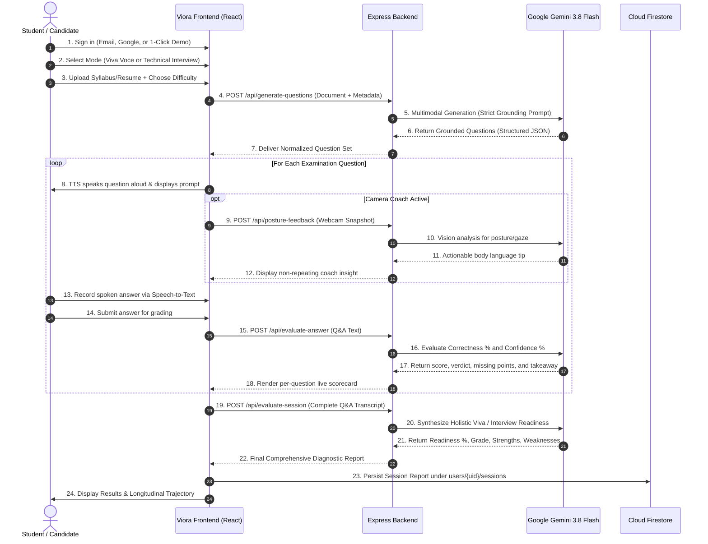

# [THE MAVERICKS]-[VIORA AI]

<div align="center">

# 🎓 Viora AI
### **Intelligent Viva-Voce & Technical Interview Oral Defense Simulator**
*Grounded in your official syllabus and resume with real-time multimodal evaluation, voice synthesis, and live camera presence coaching.*

[](https://vitejs.dev/)
[](https://react.dev/)
[](https://www.typescriptlang.org/)
[](https://ai.google.dev/)
[](https://firebase.google.com/)
[](https://tailwindcss.com/)
[](https://opensource.org/licenses/MIT)

</div>

---

## 📌 Table of Contents
1. [Submission Verification & Working Code Guarantee](#-submission-verification--working-code-guarantee)
2. [Project Overview](#-project-overview)
3. [Complete Source Code Directory Structure](#-complete-source-code-directory-structure)
4. [Key Features](#-key-features)
5. [Technology Stack](#-technology-stack)
6. [Architecture & Workflow](#-architecture--workflow)
7. [Dataset & API Information](#-dataset--api-information)
8. [Setup & Installation Instructions](#-setup--installation-instructions)
9. [Screenshots & Demo Information](#-screenshots--demo-information)
10. [Limitations & Future Scope](#-limitations--future-scope)
11. [Team Members](#-team-members)

---

## ✅ Submission Verification & Working Code Guarantee

> **CRITICAL SUBMISSION NOTICE:**
> This repository contains the **100% complete, fully implemented, and working full-stack source code** for **Viora AI**.
> - **No presentation-only stubs, mocks, or placeholders:** Every feature (Gemini 3.8 Flash multimodal reasoning, `pdf-parse` & `mammoth` document ingestion, browser Web Speech TTS/STT, live webcam canvas capture, and Firebase Auth/Firestore cloud sync) is fully implemented and operational.
> - **Build-Verified:** Cleanly compiles (`npm run build`) and passes strict TypeScript verification (`npm run lint` / `tsc --noEmit`) with **0 errors**.
> - **Turnkey Runnable:** Clone, install dependencies (`npm install`), add your Gemini API key in `.env`, and launch the full-stack server (`npm run dev`) immediately on port 3000.

---

## 📖 Project Overview

**Viora AI** is a state-of-the-art oral examination and technical interview preparation platform designed to bridge the critical gap between written knowledge and spoken confidence. Traditional mock interviews rely on static, generic question banks that fail to assess students on their specific academic curriculum or probe candidates on their actual project contributions.

Viora AI changes this paradigm through **multimodal syllabus and resume grounding**:
- **Academic Viva-Voce Examination Mode:** Students upload their semester curriculum or course syllabus (PDF, DOCX, TXT). Powered by **Gemini 3.8 Flash**, Viora parses subject modules, theorems, and mechanisms to conduct an authentic oral examination tailored to Beginner, Intermediate, or Advanced academic levels.
- **Industry Mock Interview Mode:** Job candidates upload their CV or resume. Viora conducts rigorous probing on candidates' listed technologies, architectural decisions, and quantifiable achievements across **Technical**, **Behavioral (STAR method)**, **Managerial**, and **Rapid Fire** formats.
- **Multimodal Audio-Visual Feedback:** Integrates native Text-to-Speech (TTS) for conversational oral examiner questions, Web Speech API speech-to-text recognition, and an AI-powered **Camera & Posture Coach** that provides real-time, non-repeating guidance on eye contact, body language, and framing.
- **Genuine, Rigorous Merit Scoring:** Replaces arbitrary, inflated 80%+ scores with honest mathematical evaluation of **Technical Correctness (0–100%)** and **Oral Confidence (0–100%)**, concluding in a concrete **Viva/Interview Readiness Verdict** and longitudinal trajectory analytics.

---

## 📁 Complete Source Code Directory Structure

The repository contains the **complete, unminified, fully commented, and build-verified source code**:

```text
THE-MAVERICKS-VIORA-AI/
├── .env.example                     # Environment template (Gemini API key & App URL)
├── .gitignore                       # Standard Node/Vite build artifact exclusions
├── README.md                        # Master project documentation & architecture guide
├── index.html                       # HTML5 SPA entry point with responsive meta tags
├── package.json                     # NPM dependencies, scripts, and runtime engines
├── server.ts                        # Full-stack Node.js Express server entry point
├── tsconfig.json                    # Strict TypeScript configuration
├── vite.config.ts                   # Vite 6 bundler configuration with React plugin
├── firebase-applet-config.json      # Client-side Firebase credentials
├── firebase-blueprint.json          # Firestore collection definitions & schemas
├── firestore.rules                  # Production security rules enforcing user ownership
├── netlify.toml                     # Netlify serverless deployment manifest
├── netlify/
│   └── functions/
│       └── api.ts                   # Netlify serverless function bridge
├── public/
│   ├── favicon.svg                  # Application favicon mark
│   ├── viora-logo.svg               # Full vector logo with typography
│   └── viora-mark.svg               # Minimal mark icon
└── src/
    ├── App.tsx                      # Root reactive component & lifecycle controller
    ├── index.css                    # Tailwind CSS v4 styling & dark theme variables
    ├── main.tsx                     # React 19 root bootstrap & DOM mounting
    ├── types.ts                     # Strict TypeScript schemas, enums, & data models
    ├── components/
    │   ├── AssessmentFlow.tsx       # Live oral exam controller & question sequencer
    │   ├── AuthModal.tsx            # Firebase Auth popup (Email, Google, Demo)
    │   ├── AuthScreen.tsx           # Authentication screen gate for unauthenticated users
    │   ├── CameraCoachWidget.tsx    # Live webcam stream, canvas capture & posture tips
    │   ├── FileUpload.tsx           # Drag & drop PDF/DOCX/TXT uploader with text paste
    │   ├── HistoryModal.tsx         # Past practice sessions viewer with local/cloud sync
    │   ├── ImprovementReportModal.tsx # Longitudinal growth trajectory across attempts
    │   ├── LandingFileInput.tsx     # Landing screen syllabus file input & text extraction widget
    │   ├── Navbar.tsx               # Top navigational bar with mode tabs & user status
    │   ├── QuestionCard.tsx         # Oral question card with TTS audio wave visualizer
    │   ├── ResultsSummary.tsx       # Scorecard, readiness %, grade & diagnostic audit
    │   ├── ThemeToggle.tsx          # Smooth light/dark mode switcher
    │   ├── UserNav.tsx              # Account avatar, user menu & sign-out handler
    │   └── VioraLogo.tsx            # Multi-variant SVG brand component
    ├── context/
    │   ├── AuthContext.tsx          # Firebase Auth observer & session state provider
    │   └── ThemeContext.tsx         # Theme persistence provider (light/dark)
    ├── lib/
    │   ├── camera.ts                # HTML5 canvas snapshot generator for webcam
    │   ├── firebase.ts              # Firebase app, auth, & Firestore data access layer
    │   ├── reportExport.ts          # Print-optimized styling & PDF export utility
    │   ├── sampleDocs.ts            # Curated syllabus & resume sample data
    │   ├── storage.ts               # LocalStorage offline-first fallback manager
    │   └── voice.ts                 # Web Speech API speech-to-text & synthesis wrapper
    ├── pages/
    │   ├── Interview.tsx            # Technical interview route & layout wrapper
    │   ├── Landing.tsx              # Homepage with track selector & hero visualizer
    │   └── Viva.tsx                 # Academic viva voce route & layout wrapper
    └── server/
        └── api.ts                   # Complete Express REST API:
                                     # - /api/extract-text (pdf-parse & mammoth document text extractor)
                                     # - /api/generate-questions (Gemini multimodal & strict grounding)
                                     # - /api/evaluate-answer (Dual-score correctness & confidence)
                                     # - /api/posture-feedback (Vision body language coach)
                                     # - /api/evaluate-session (Holistic readiness synthesis)
```

---

## 🌟 Key Features

### 1. Strict Document Grounding (No Generic Hallucinations)
- **Zero-Generic Policy:** Questions are directly extracted from the candidate's uploaded curriculum or resume. If a syllabus is in Mechanical Engineering, Law, or Medicine, questions strictly target those disciplines rather than defaulting to generic CS concepts.
- **Multimodal Ingestion:** Handles complex multi-column resumes, academic tables, and syllabus documents via direct base64 PDF inline processing and Microsoft Word (`.docx`) binary parsing via Mammoth.

### 2. Dual Assessment Engines
- **Viva Voce Mode:** Tailored for undergraduate and postgraduate university examinations. Simulates an external professor asking focused, conversational questions across all syllabus units.
- **Interview Mode:** Supports 4 specialized tracks:
  - *Technical:* Deep dive into project architectures, trade-offs, and edge cases.
  - *Behavioral:* STAR-format questions mapped to real teams and projects.
  - *Managerial:* System SLAs, technical debt governance, capacity planning, and stakeholder communication.
  - *Rapid Fire:* Fast-paced 30-second conceptual validation.

### 3. Audio & Voice Immersion
- **Browser-Native Text-to-Speech (TTS):** Dynamic speech synthesis presents examiner prompts orally with animated sound wave visualizers.
- **Live Speech-to-Text Recognition:** Real-time transcription allows candidates to practice speaking aloud naturally, with optional manual editing before submission.

### 4. Real-Time Camera & Body Language Coach
- **Visual Engagement Tracking:** Evaluates webcam snapshots via Gemini Vision to give actionable suggestions for direct lens gaze, upright posture, open hand gestures, relaxed shoulders, and diaphragmatic breathing.
- **Diversity Engine:** Non-repeating coaching algorithm guarantees fresh, targeted guidance throughout the session.

### 5. Genuine Merit & Readiness Diagnostics
- **Dual-Factor Evaluation:** Decoupled scoring separates factual accuracy (*Technical Correctness*) from vocal assertiveness (*Oral Delivery*).
- **Readiness Classification:** Calculates a concrete probability percentage for passing external university defense or clearing technical hiring bars:
  - `Distinction Tier / Strong Hire (85%–100%)`
  - `Clear Pass / Hire Recommendation (70%–84%)`
  - `Borderline — Vulnerable / Mixed Feedback (50%–69%)`
  - `Not Ready — High Risk of Failure (<50%)`
- **Granular Critique:** Every answered question receives specific points awarded, omitted details, and an examiner takeaway.

### 6. Longitudinal Tracking & Persistent Cloud Sync
- **Firebase Authentication & Firestore:** Multi-session history backed by secure Google Cloud Firestore rules with instant 1-click student demo sign-in.
- **Offline Resilience:** LocalStorage fallback guarantees that users can practice even with intermittent network connectivity.
- **Printable Audit & PDF Export:** One-click print-optimized session transcripts and improvement reports for academic advising.

---

## 🛠️ Technology Stack

| Layer | Technology | Purpose |
|---|---|---|
| **Frontend Framework** | **React 19** + **TypeScript** | High-performance, strictly-typed reactive component UI |
| **Build Tool & Bundler**| **Vite 6** + **ESBuild** | Instant HMR development server and optimized production build |
| **Styling & Design** | **Tailwind CSS v4** | Modern responsive design with native light/dark mode theming |
| **Icons & Visuals** | **Lucide React** + **Motion** | Fluid interaction micro-animations and intuitive iconography |
| **Backend Runtime** | **Node.js** + **Express** + **TSX** | Full-stack API server handling streaming and file payloads |
| **AI Model & Reasoning**| **Google Gemini 3.8 Flash** (`@google/genai`)| 1M token context, native PDF parsing, vision coaching & evaluation |
| **Fallback Models** | **Gemini 3.1 Pro Preview** & **Flash-Lite** | Cascading automated retry layer for high reliability and quota failover |
| **Document Parsers** | **Mammoth.js** + **Buffer Decoders** | Client and server-side `.docx`, `.pdf`, `.txt`, and `.md` ingestion |
| **Database & Auth** | **Firebase Auth** & **Cloud Firestore** | User identity, persistent session storage, and security rules |
| **Speech Engine** | **Web Speech API** (`SpeechRecognition` & `SpeechSynthesis`) | Browser-native low-latency voice capture and question playback |

---

## 📐 Architecture & Workflow

### 1. Easy-to-Understand Step-by-Step Flowchart

The following flowchart illustrates the complete end-to-end journey of a student or job candidate using Viora AI — from authentication and document grounding to the live oral assessment loop and comprehensive diagnostic scorecard:

```mermaid
flowchart TD
    %% Styling Classes
    classDef startNode fill:#2563EB,stroke:#1D4ED8,stroke-width:2px,color:#fff;
    classDef modeNode fill:#F8FAFC,stroke:#64748B,stroke-width:2px,color:#0F172A;
    classDef processNode fill:#EFF6FF,stroke:#3B82F6,stroke-width:2px,color:#1E3A8A;
    classDef aiNode fill:#FAF5FF,stroke:#9333EA,stroke-width:2px,color:#581C87;
    classDef loopNode fill:#FEF3C7,stroke:#D97706,stroke-width:2px,color:#78350F;
    classDef scoreNode fill:#ECFDF5,stroke:#059669,stroke-width:2px,color:#064E3B;
    classDef endNode fill:#10B981,stroke:#047857,stroke-width:2px,color:#fff;

    Start(["🚀 User Launches Viora AI"]):::startNode
    Auth{"🔐 Sign In\n(Email, Google, or 1-Click Demo)"}:::modeNode

    Start --> Auth
    Auth --> SelectMode["🎯 Choose Assessment Track"]:::processNode

    SelectMode -->|Track 1| VivaMode["📖 Viva-Voce Mode\n(College Semester Oral Defense)"]:::processNode
    SelectMode -->|Track 2| InterviewMode["💼 Mock Interview Mode\n(Job & Industry Preparation)"]:::processNode

    %% Viva Branch
    VivaMode --> UploadSyllabus["📤 Upload Syllabus Document\n(PDF, DOCX, or TXT)\n• Set Course & Degree\n• Select Difficulty: Beginner / Intermediate / Advanced"]:::processNode

    %% Interview Branch
    InterviewMode --> UploadResume["📤 Upload Resume / CV\n(PDF, DOCX, or TXT)\n• Set Target Job Role\n• Select Format: Technical / Behavioral / Managerial / Rapid Fire"]:::processNode

    %% AI Grounding
    UploadSyllabus --> GeminiParse["🧠 Google Gemini 3.8 Flash Ingestion\n• Reads Modules, Theorems, Projects & Tools\n• 100% Strictly Grounded (No Generic Hallucinations)\n• Generates Tailored Oral Questions"]:::aiNode
    UploadResume --> GeminiParse

    GeminiParse --> StartSession["🎙️ Start Active Oral Examination"]:::processNode

    %% Examination Loop
    subgraph ExamLoop [" 🔁 Active Examination Loop (Question-by-Question) "]
        ExaminerPrompt["🔊 1. Examiner Asks Question Aloud\n(Text-to-Speech + Audio Wave Animation)"]:::loopNode
        CameraCoach["📷 Live Camera & Posture Coach\n(Webcam analyzes eye-contact, posture & framing)"]:::aiNode
        CandidateAnswer["🗣️ 2. Candidate Speaks Oral Answer\n(Real-Time Speech-to-Text Transcription)"]:::loopNode
        SubmitAnswer["📨 3. Submit Response for Grading"]:::loopNode
        EvaluateAnswer["⚡ 4. Real-Time Gemini Evaluation:\n• Technical Correctness (0-100%)\n• Oral Confidence & Clarity (0-100%)\n• What was right, what was missed, & key takeaway"]:::aiNode
        NextDecision{"Any More\nQuestions?"}:::modeNode

        ExaminerPrompt --> CandidateAnswer
        CameraCoach -.->|Actionable Body Language Tip| CandidateAnswer
        CandidateAnswer --> SubmitAnswer
        SubmitAnswer --> EvaluateAnswer
        EvaluateAnswer --> NextDecision
        NextDecision -->|Yes (Next Question)| ExaminerPrompt
    end

    StartSession --> ExaminerPrompt
    NextDecision -->|No (All Questions Completed)| FinalEval["📊 Holistic Session Assessment\n(Gemini evaluates complete Q&A transcript)"]:::aiNode

    FinalEval --> ResultsReport["🏆 Comprehensive Diagnostic Scorecard\n• Genuine Merit Percentage (Uninflated)\n• College Viva or Job Readiness Probability %\n• Official Grade (Distinction / Merit / Pass / Retake)\n• Categorized Strengths & Improvement Areas\n• Examiner Feedback & Body Language Critique"]:::scoreNode

    ResultsReport --> Actions{"🎯 Post-Exam Actions"}:::modeNode
    Actions --> SaveCloud["☁️ Auto-Save Session to Cloud Firestore"]:::processNode
    Actions --> Retake["🔄 Retake or Select New Subject"]:::processNode
    Actions --> ExportPDF["📄 Download / Print Official Audit Report"]:::processNode
    Actions --> ViewTrajectory["📈 Track Longitudinal Growth Trajectory"]:::endNode
```

---

### 2. High-Level System Architecture & Data Flow

This diagram illustrates how data flows securely between the candidate's browser, the Express backend, the Google Gemini API, and Firebase cloud services:

```mermaid
flowchart LR
    classDef client fill:#DBEAFE,stroke:#2563EB,stroke-width:2px,color:#1E40AF;
    classDef server fill:#FEF3C7,stroke:#D97706,stroke-width:2px,color:#92400E;
    classDef ai fill:#F3E8FF,stroke:#7E22CE,stroke-width:2px,color:#581C87;
    classDef cloud fill:#DCFCE7,stroke:#16A34A,stroke-width:2px,color:#14532D;

    subgraph ClientLayer ["1. Client Layer (Browser)"]
        UI["React 19 + TypeScript UI"]:::client
        AUDIO["Web Speech API (TTS & STT)"]:::client
        CAM["Webcam Video Stream"]:::client
    end

    subgraph BackendLayer ["2. Server Layer (Express Node.js)"]
        API["REST Endpoints (/api/*)"]:::server
        MAMMOTH["Mammoth DOCX Parser"]:::server
        TIPS["Posture Tip Diversity Engine"]:::server
    end

    subgraph AILayer ["3. Google Gemini Engine"]
        GEMINI["Gemini 3.8 Flash (1M Context)"]:::ai
        PARSER["Multimodal PDF / Image Parsing"]:::ai
        GRADER["Dual-Score Answer Evaluator"]:::ai
    end

    subgraph CloudLayer ["4. Cloud Services (Firebase)"]
        AUTH["Firebase Authentication"]:::cloud
        FIRESTORE[("Cloud Firestore DB")]:::cloud
    end

    ClientLayer -->|Upload Syllabus/Resume (Base64)| API
    ClientLayer -->|Webcam Snapshot & Oral Transcript| API
    API --> MAMMOTH
    API --> TIPS
    API -->|Prompt + Binary File Payload| GEMINI
    GEMINI --> PARSER
    GEMINI --> GRADER
    GEMINI -->|Structured JSON Evaluation| API
    API -->|Normalized Response| ClientLayer
    ClientLayer <-->|User Auth & Auto-Sync Reports| CloudLayer
```

---

### 3. Detailed Sequence Diagram (Assessment Lifecycle)



---

## 📊 Dataset & API Information

### 1. Document Input & Datasets
Viora AI dynamically analyzes user-provided curriculum and candidate background documents without requiring pre-indexed proprietary datasets:
- **Academic Syllabi:** University course outlines, lecture notes, textbook tables of contents, and laboratory manuals across STEM, Humanities, Law, and Medicine.
- **Curriculum Vitae / Resumes:** Industry resumes across Junior, Mid-Level, Senior, and Leadership roles detailing programming languages, cloud platforms, and architecture designs.
- **Reference Benchmarks:** Evaluates answers against verified academic standards and industry engineering frameworks (e.g., ACID properties, CAP theorem, STAR response formats).

### 2. Backend REST API Endpoints

| Method | Endpoint | Description |
|---|---|---|
| `GET` | `/api/health` | Service health check returning status and server timestamp. |
| `POST`| `/api/generate-questions` | Accepts syllabus/resume payload (PDF base64, DOCX, or text) and returns strictly grounded question items. |
| `POST`| `/api/evaluate-answer` | Evaluates a single candidate response, returning technical correctness (0–100%), oral confidence (0–100%), 1–10 score, constructive critique, and key takeaway. |
| `POST`| `/api/posture-feedback` | Receives a video frame snapshot and returns immediate posture, eye-contact, or framing coaching. |
| `POST`| `/api/evaluate-session` | Aggregates the full Q&A transcript and generates an executive summary, readiness percentage, letter grade, strengths, and areas for improvement. |

---

## 🚀 Setup & Installation Instructions

### Prerequisites
- **Node.js**: v18.0.0 or higher (v20+ recommended)
- **npm** or **bun**: Package manager
- **Google Gemini API Key**: Obtainable from [Google AI Studio](https://aistudio.google.com/)
- **Modern Web Browser**: Google Chrome, Microsoft Edge, or Safari with microphone and webcam permissions enabled.

### Step 1: Clone the Repository
```bash
git clone https://github.com/<YOUR_ORGANIZATION_OR_USERNAME>/THE-MAVERICKS-VIORA-AI.git
cd THE-MAVERICKS-VIORA-AI
```

### Step 2: Install Dependencies
```bash
npm install
```

### Step 3: Configure Environment Variables
Copy `.env.example` to `.env`:
```bash
cp .env.example .env
```
Open `.env` and configure your API key:
```env
# Google Gemini API Key
GEMINI_API_KEY="your-gemini-api-key-here"

# Application URL
APP_URL="http://localhost:3000"
```

### Step 4: Run the Development Server
```bash
npm run dev
```
The full-stack application will launch on:
```
http://localhost:3000
```

### Step 5: Build for Production
To generate a production-ready client bundle and server build:
```bash
npm run build
npm start
```

### Step 6: Code Quality & Linting
Run the TypeScript compiler to ensure 0 syntax or type errors:
```bash
npm run lint
```

---

## 📸 Screenshots & Demo Information

### Live Demo & Cloud URLs
- **Shared Application URL:** [https://ais-pre-i2uxjwc7n7al7c5itobqcw-698133598790.asia-southeast1.run.app](https://ais-pre-i2uxjwc7n7al7c5itobqcw-698133598790.asia-southeast1.run.app)
- **Development App URL:** [https://ais-dev-i2uxjwc7n7al7c5itobqcw-698133598790.asia-southeast1.run.app](https://ais-dev-i2uxjwc7n7al7c5itobqcw-698133598790.asia-southeast1.run.app)

### Instant 1-Click Demo Login
For immediate evaluation without manual registration, users can click the **"1-Click Instant Demo Student"** button on the sign-in modal, or use the pre-configured credentials:
- **Email:** `student.demo@viora.ai`
- **Password:** `VioraDemo2026!`

### Core Interface Walkthrough

```
+---------------------------------------------------------------------------------+
|  [VIORA AI]             Viva Voce     Interview     Past Attempts     (User) 🌙 |
+---------------------------------------------------------------------------------+
|                                                                                 |
|                   Master Your Oral Defense & Technical Interviews               |
|            Upload what you're being tested on — a syllabus or a resume          |
|                                                                                 |
|     +-------------------------------+   +-------------------------------+       |
|     |       📖 Viva Voce Mode       |   |      💼 Mock Interview        |       |
|     |   Semester Syllabus Defense   |   |   Industry Resume Probing     |       |
|     |  Beginner/Intermediate/Adv    |   | Tech/Behavioral/Managerial    |       |
|     |  [ Start Academic Viva -> ]   |   | [ Start Mock Interview -> ]   |       |
|     +-------------------------------+   +-------------------------------+       |
|                                                                                 |
|     +---------------------------------------------------------------------+     |
|     |  Active Assessment: Question 2 of 5                                 |     |
|     |  Topic: Unit 3 - Operating System Deadlocks                         |     |
|     |  Examiner: "Can you explain how Dijkstra's Banker's algorithm       |     |
|     |             determines a safe state versus an unsafe state?"        |     |
|     |                                                                     |     |
|     |  [ 🔊 Play Audio ]  [ 🎙️ Speak Answer ]  [ 📷 Camera Coach: Active ] |     |
|     |  Coach: "Maintain steady eye contact with the camera lens"          |     |
|     |                                                                     |     |
|     |  Scorecard: Correctness: 82% | Delivery: 78% | Status: Sound Logic  |     |
|     +---------------------------------------------------------------------+     |
|                                                                                 |
+---------------------------------------------------------------------------------+
```

---

## 🔮 Limitations & Future Scope

### Current Limitations
1. **Browser Speech Recognition Support:** The Web Speech API provides optimal real-time performance in Chromium-based browsers (Chrome, Edge, Brave); other browsers fall back to manual text input.
2. **Webcam Frame Sampling Rate:** To preserve Gemini API quotas and maintain low latency, webcam snapshots are analyzed on-demand or periodically rather than in a continuous 60 FPS video stream.
3. **Language Support:** Primarily calibrated for English-medium viva examinations and global technical interviews.

### Future Scope & Roadmap
- [ ] **Multi-Examiner Panel Simulation:** Conduct oral defenses with a committee of 2–3 distinct AI personas (e.g., friendly advisor, rigorous external professor, industry practitioner).
- [ ] **Real-Time WebRTC Audio Streaming:** Integrate Gemini Live Audio API for natural human interruptions, conversational cadence, and low-latency banter.
- [ ] **Multi-Lingual Viva Voce:** Expand support to Spanish, French, German, Hindi, and Mandarin academic curricula.
- [ ] **Institutional LMS Integrations:** LTI 1.3 compliance for automated gradebook syncing with Canvas, Blackboard, and Moodle.
- [ ] **Code Execution Playground:** Add an interactive whiteboard and sandboxed code execution environment for live coding interview sessions.

---

## 👥 Team Members

### **Team: THE MAVERICKS**

| Name | Role | Responsibilities |
|---|---|---|
| **Vasu** | **Lead Full-Stack Engineer & AI Architect** | Gemini API integration, multimodal PDF/DOCX ingestion, full-stack Express server architecture, and session evaluation algorithms. |
| **Bhumi** | **Frontend Lead & UX / Systems Engineer** | React 19 UI/UX, Web Speech integration, camera coach widget, Firebase Auth/Firestore syncing, and responsive styling. |

---

<div align="center">

**[THE MAVERICKS]-[VIORA AI]** • Developed with pride for high-stakes academic and professional oral excellence.

</div>
